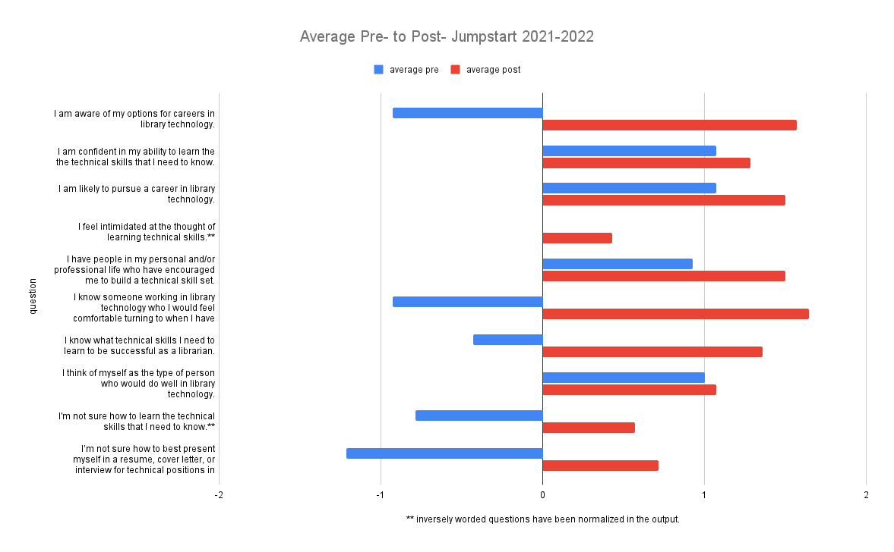
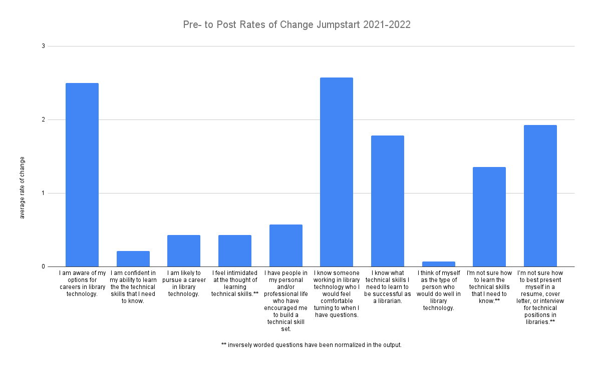
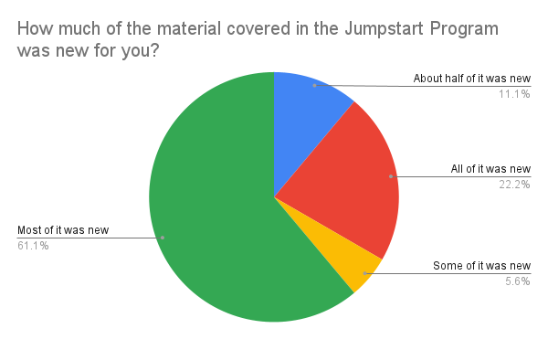
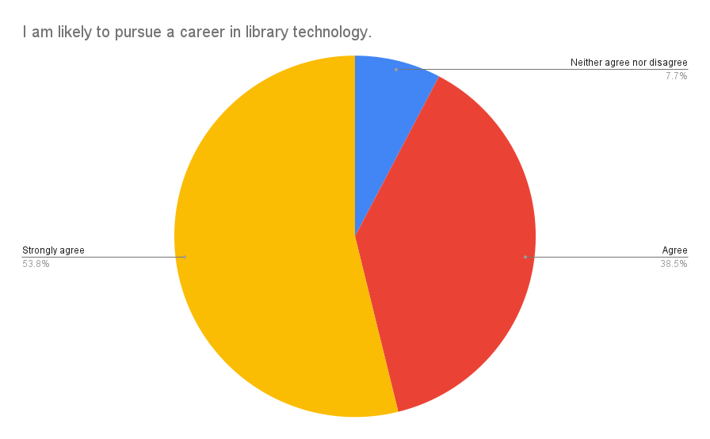

Our assessment measures included a pre-program knowledge & attitudes survey, a post-program knowledge & attitudes survey, a post-program general feedback survey and a six month follow up video interview. 

## Determining goals and desired outcomes ##
Before designing our surveys, we spent some time reviewing our program’s guiding principles and objectives. What did we want participants to walk away with? What learning outcomes were we aiming to achieve? 

### Building appropriate tools ###
Based on this review, we generated the following survey questions: 

#### Pre-Program Knowledge & Attitudes Survey ####
- Please list the job titles you associate with librarianship:
- Please list the job titles you associate with technical librarianship:

<i> The following questions were presented with the option to answer on a 5 point Likert scale ranging from “strongly disagree” to “strongly agree”: </i>

  - I know what technical skills I need to learn to be successful as a librarian. 
  - I’m not sure how to learn the technical skills that I need. 
  - I am confident in my ability to learn technical skills.
  - I feel intimidated at the thought of learning technical skills. 
  - I am aware of my options for careers in library technology.
  - I am likely to pursue a career in library technology
  - I think of myself as the type of person who would do well in library technology. 
  - I have people in my personal and/or professional life who have encouraged me to build a technical skill set. 
  - I know someone working in library technology who I would feel comfortable turning to when I have questions. 
  - I’m not sure how to best present myself in a resume, cover letter, or interview for technical positions in libraries. 

- Please list/describe any coursework, projects, and jobs/internships you have completed that are relevant to developing technical skills in librarianship: 

#### Post-Program Knowledge & Attitudes Survey ####
- Please list the job titles you associate with librarianship:
- Please list the job titles you associate with technical librarianship:
- How much of the material covered in the Jumpstart Program was new for you? <i>(response options = “none of it was new”, “some of it was new”, “about half of it was new”, “most of it was new”, “all of it was new”).</i> 

<i> The following questions were presented with the option to answer on a 5 point Likert scale ranging from “strongly disagree” to “strongly agree”: </i>
    
- I learned a lot about technical careers in libraries. 
- I learned a lot about the technical skills I will need to be successful as a librarian. 
- The Jumpstart Program felt like a valuable use of my time. 
- I plan to keep in contact with my mentor and others that I met while in the program. 
- I know what technical skills I need to learn to be successful as a librarian. 
- I’m not sure how to learn the technical skills that I need. 
- I am confident in my ability to learn technical skills.
- I feel intimidated at the thought of learning technical skills. 
- I am aware of my options for careers in library technology.
- I am likely to pursue a career in library technology
- I think of myself as the type of person who would do well in library technology. 
- I have people in my personal and/or professional life who have encouraged me to build a technical skill set. 
- I know someone working in library technology who I would feel comfortable turning to when I have questions. 
- I’m not sure how to best present myself in a resume, cover letter, or interview for technical positions in libraries. 

- Please list/describe any coursework, projects, and jobs/internships you plan to take that are relevant to developing technical skills in librarianship: 

#### Post-Program Satisfaction Survey ####
- Overall, how satisfied were you with your experience with the Jumpstart Program? <i> (response options = 5 point Likert scale ranging from “very dissatisfied” to “very satisfied”). </i>

Please rate the following components of the program:
<i> (response options = 5 point Likert scale ranging from “very unsatisfactory” to “very satisfactory”).</i>

- Technical skills workshops (Intro to Git & GitHub, Intro to Python with Twitter Bots, Intro to Web Development, Intro to Machine Learning)
- Panel presentations (career path panel, day-in-the-life panel, tech showcase, Q&A with Libraries admin)
- "Applying to Your First Library Tech Job" session
- One-on-one mentorship 
- Program content overall:

- Do you have any additional comments concerning the content of the Jumpstart Program?

Please rate the following logistical components of the program: 
<i> (response options = 5 point Likert scale ranging from “very unsatisfactory” to “very satisfactory”).</i>

- Communication leading up to the event
- Live captioning services
- Attention paid to accessibility concerns
- Handling of troubleshooting during technical workshops 
- The flow and schedule of events 
- The application process

- Do you have any additional comments concerning the logistics of the Jumpstart Program?

- What was your favorite part of the Jumpstart program experience?
- What was your least favorite part of the Jumpstart program experience? 
- Overall, did the Jumpstart program meet your expectations? Explain.
- Do you have any suggestions for improvement to the Jumpstart program?
- I am likely to recommend the Jumpstart Program to other library school students. <i> (response options = 5 point Likert scale ranging from “very unlikely” to “very likely”).</i>

#### Post-Program Six Month Follow-up Video Interview ####
- Did your participation in the Jumpstart Program help inform your planning for the rest of your graduate school experience?
    + Did it influence the types of courses, jobs, and internships you took up?
    + What technical coursework have you taken/do you plan to take?
    + What sorts of part time jobs and/or internships have you had/do you plan to have?
- Have your short and/or long-term career goals shifted since you started your graduate school program to now? If yes, how so? 
    + What role, if any, do you think the Jumpstart program had in any shifts?
- What kinds of jobs do you plan to apply to after you graduate?
    + What sorts of job titles are you looking at?
- How have you progressed in your acquisition of technical skills?
    + What skills have/are you trying to develop?
    + What is going well?
    + Are you experiencing roadblocks? What are they?
    + What resources are you using?
- Have you kept in contact with other attendees?
- Have you kept in contact with your mentor?
- Would you recommend the Jumpstart Program to other library school students?

Due to the nature of this survey and its involvement of human subjects, we sought IRB approval from our institution, which involved drafting a formal informed consent document, ensuring our data would be de-identified, and using our institutional Qualtrics account to instantiate our surveys.

## Soliciting participation and feedback ##
With such a small sample size given our cohort of 8 participants in 2020 and 9 in 2021, we were aiming for as high a rate of participation as possible. To accomplish this, we began recruiting participants to the study early on, sending the pre-program knowledge & attitudes survey out shortly after our tech & accommodations survey. We followed up this initial outreach with several reminder messages and also gave participants time to complete the survey during the first session of the program. In all of our communications, we emphasized the voluntary nature of the study while noting that participation would be beneficial to us in helping to better design future iterations of the program. We left the survey open for two weeks after the completion of the program to allow for optimal participation.    

Across all three cohorts, we have seen...
- A participation rate of 78% for our general satisfaction surveys
- A participation rate of 50% for our pre- to post- knowledge and attitudes surveys
- And 7 completed 6-mo. follow up interviews (interviews for the 2022 cohort forthcoming)

## Interpreting the results ##
In interpreting our results, we were able to directly compare participant responses to questions that appeared on both the pre- and post- knowledge and attitudes surveys, such as “I am confident in my ability to learn technical skills.” and “I am likely to pursue a career in library technology.” We were looking to see if there was an overall improvement in responses from pre- to post- (participants moving from ‘somewhat disagree’ to ‘agree’, for example), or even perhaps a regression.

In terms of questions that were unique to the pre- and post- surveys, we conducted hypothesis testing to check our assumptions. We would expect, for example, that someone who answered “disagree” or “strongly disagree” to the pre-program survey question: “I am aware of my options for careers in library technology.” would answer somewhere in the range of “agree” to “strongly agree” to the post-survey question “I learned a lot about technical careers in libraries.” if they also moved to “agree” or “strongly agree” on the former. If not, we would have to reckon with and extrapolate an explanation for such a discrepancy. 

Our key findings are summarized below, and a more comprehensive overview can be viewed [at this link](https://drive.google.com/file/d/1PJMLYgrd2DvJ01au1rBoHJa3Rb2TrQBU/view?usp=sharing). 

### General Satisfaction Survey Results -- ###
- All of our participants held at least one identity underrepresented in technology or librarianship. 
- All participants were either 'satisfied' or 'very satisfied' with their overal Jumpstart experience 
- All participants who completed our surveys strongly agreed with these statements: 
  + “The Jumpstart Program felt like a valuable use of my time.” (n=18)
  + “I am likely to recommend the Jumpstart Program to other LIS/IS students.” (n=22)    
- All participants found the content and administration of the program to be 'satisfactory' or 'very satisfactory', though there is room for improvement when it comes to troublshooting, as two participants have answered 'unsatisfactory'.

### Pre- to Post- Knowledge & Attitudes Survey Results -- ###

At an aggregate level, we saw pre- to post- improvements across all questions. 

The largest positive effect sizes were observed for the following:

- “I am aware of my options for careers in library technology.”  
- “I know someone working in library technology who I would feel comfortable turning to when I have questions.”  
- “I’m not sure how to best present myself in a resume, cover letter, or interview for technical positions in libraries.**”   

Followed closely by:  

- “I know what technical skills I need to learn to be successful as a librarian.”        
- “I'm not sure how to learn the technical skills that I need to know.**”

We take this to mean that we met our objectives of raising awareness of tech careers in libraries and how to attain the skills necessary for such careers as well as fostering a community of support.

The questions that had the smallest positive effect sizes in the post- responses were also those that participants answered the most positively coming in. (In other words, there wasn’t as much room to improve for these metrics!)

It is worth noting, however, that the smallest effect size occurred for the question “I think of myself as the type of person who would do well in library technology”, and for our 2021 cohort, there was actually a negative effect size. Knowing that all of our participants held at least one identity underrepresented in librarianship, this could be attributed to a continuing lack of representation in the makeup of library technology professionals that participants are exposed to. We work to improve this each year by increasing the diversity of those involved with administering the program, including panelists, workshop leaders, and mentors.

Looking at the data at an individual level does indicate a handful of other “regressions” in some cases: 

- One participant moved from ‘strongly agree’ to ‘agree’ on <i> “I am confident in my ability to learn the technical skills that I need to know” </i>, for example. 
  + BUT they also moved from ‘neither agree or disagree’ to ‘strongly agree’ on <i>“I am likely to pursue a career in library technology”</i> AND they answered that almost all of the content was new for them.

We take this to mean that there may be some Dunning-Kruger effect at play – i.e., participants were perhaps a bit over-confident coming in, and then became overwhelmed at the amount of things they were coming to see they needed to know. Luckily, this is a completely normal part of the learning process. The vast majority of participants still ‘agree’ or ‘strongly agree’ that they are likely to pursue a career in library technology.

{width=65%}

### 6 Month Follow Up Interview Results ###
From our 6 month follow up interviews, we gleaned that the Jumpstart Program introduced participants to career opportunities in library technology they hadn’t known about or considered before.It impacted the types of courses they took and internships they considered, and the confidence with which they approached them 

There were reports of being better able to read tech job descriptions and know what employers are looking for and feeling ‘primed’ for tech courses and tech interviews. Participants also discussed taking to heart some of the strategies we had recommend for continued skill building, such as the personal projects they had taken up on the side and informal learning groups they had started with their peers

One of our 2020 participants really encapsulated things nicely when they said: <i> “I don't think it's like a bootcamp...it's more like a space to introduce students to this world [of library technology] so that they make better choices about what they want to learn how they want to spend their time in grad school.” </i>

> Tip: Spend concentrated time early in the planning process determining what metrics of success you will measure your program by and design your data collection tools accordingly, seeking IRB approval if needed.   

[Next >> Further Reading/Suggested Resources](https://ncsu-libraries.github.io/jumpstart-framework/resources.html)

 

Last updated on `r format(Sys.time(), '%B %d, %Y.')`
