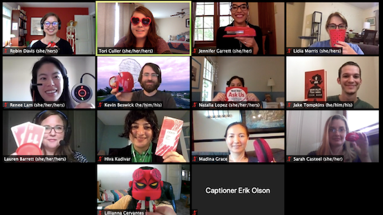

## Introduction ## 

The [Library Technology Career Jumpstart Program ](https://www.lib.ncsu.edu/jumpstart) is a new initiative from NC State University Libraries held for the first time virtually August 3-7, 2020. The program is a free, immersive, week-long experience that helps to position first-year library school students for a career in library technology upon graduation.

Jumpstart participants can expect to...

- complete technical workshops
- add to their technical portfolios
- glimpse “a day in the life” of tech librarians
- learn how to apply and interview for technical positions in libraries
- develop an ongoing relationship with a mentor

Response to the first iteration of the program was positive overall. As one participant noted: 

> “The workshops provided enough direction for me to identify possible interests in lib tech and explore things further on my own. I also really value the mentorship and getting to know the librarians at State. I plan on staying connected with them as I build toward a career in lib tech. There is a huge need for exactly what Jumpstart is offering so I would definitely recommend this program to other LIS students and am really excited to see the program hopefully continue in future years and expand. ”

Read more about what participants had to say in this profile piece: [Library Technology Career Jumpstart Program prepares students to meet the unknown needs of tech-infused futures->](https://www.lib.ncsu.edu/stories/library-technology-career-jumpstart-program-prepares-students-meet-unknown-needs-tech)

 

 

[Next >> About this Guide](https://ncsu-libraries.github.io/jumpstart-framework/about.html)

 

Last updated on `r format(Sys.time(), '%B %d, %Y')`

