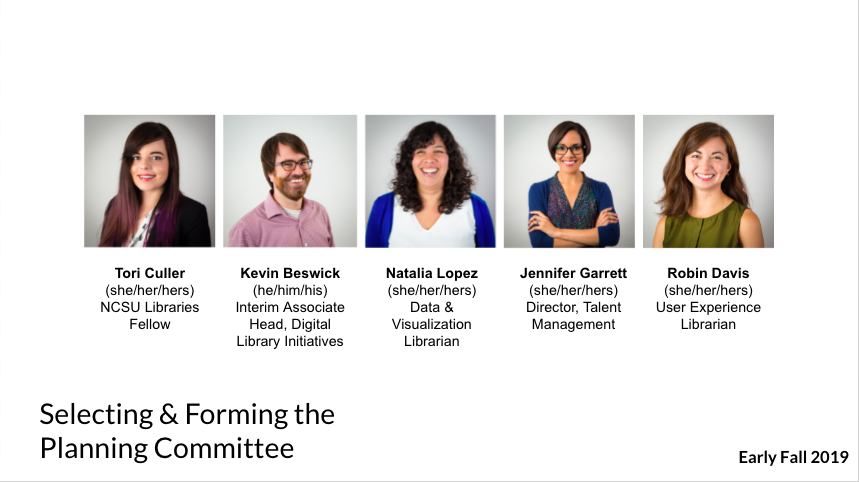

## Recruiting a well-rounded planning committee ##

In building a planning committee, we wanted the membership to be representative of the diverse cohort that were hoping to build, to span a variety of technical positions in libraries, and to bring in skills such as event planning and recruitment. We wanted to keep our planning committee relatively small, so we sought colleagues who met many of these criteria at once and who had expressed initial interest and excitement in the program. 

The planning committee we created in the end was effective because each member filled a needed role: 
  
- Tori’s position as a Libraries Fellow allowed her to devote half her time to this initiative as **project manager**. 
- Kevin’s position as Lead Librarian for Software Development/Interim Associate Head for Digital Library Initiatives meant that he was able to offer **technical expertise and support**, providing direction to what our technical skills workshops should look like. 
- Natalia’s position as Data & Visualization Librarian provided the group with insight into what technical positions across departments entail, and her background and interest in **community building** helped us to think through how to create a strong cohort experience for our participants -- even in a virtual environment. 
- Jennifer’s position as the Director of Talent Management informed how we ran our application and selection process and provided direction for how to ensure that we were **recruiting** a diverse and well-rounded cohort.
Robin’s position as a User Experience Librarian gave us yet another look into what technical positions can look like in libraries while also providing expertise in areas like **accessibility and web content creation.** 

> Tip: Think through what types of roles, skills, and expertise you need for your own planning committee and recruit accordingly.

## Devising a clear vision statement and set of guiding principles ##
Once our planning committee had been formed, we needed to clarify as a group what our vision and guiding principles for the program were. To this end, we spent our first few meetings together brainstorming what our most important goals were and how we wanted to communicate the program vision to our audience. The guiding principles and vision statement helped the planning committee to cohere around a shared outcome and also served as marketing copy we used on our program website and in outreach to potential applicants.

### Jumpstart Program Vision Statement: ###
  
  “We seek applicants who share our Libraries’ [strategic values](https://docs.google.com/document/d/12wc4flrnVizBvBG0ncoQpG9G43xJ0CwFhvW01N5UpPg/edit) that include Diversity, Access, Experimentation, Agility, Collaboration, and Delight. As you answer the short questions in this application, we encourage you to share how these values play a part in your experiences and professional goals. You may also want to review [our Libraries’ Diversity & Inclusion Statement.](https://www.lib.ncsu.edu/equity-diversity-inclusion)”

### Jumpstart Program Guiding Principles: ### 
  
The Jumpstart Program seeks to...

- Increase awareness of of technology careers in libraries
- Increase diversity (broadly defined) in this area of the profession
- Impart strategies for learning technical skills
- Provide concrete steps forward towards a career pathway in library technology
- Create a welcoming and inclusive space where a diverse cohort can learn from each other
- Foster a community of professional and interpersonal support

> Tip: Spend concentrated time early on creating a vision statement and set of guiding principles. Use these in your marketing materials to get your message out.

## Getting organizational buy-in ##

Getting organizational buy-in is an essential part of the early stages of planning a Jumpstart program. Since we planned to rely heavily on the expertise of a large number of our colleagues across the organization, we identified potential key champions across the Libraries to share our early vision and ideas for the program. This was both an opportunity to gain support and workshop our ideas for the program to garner feedback. These supporters weren’t just library administrators -- in our case, they also consisted of colleagues in other departments.

Gaining support from library administration early is key. The work you’ve done to build a vision and guiding principles is important here, but it is also important to think about the value of the program to your organization -- why would your organization want to invest time and energy into something like this? In our case, the two big factors were supporting recruitment of technical librarians from underrepresented backgrounds and investing in the library profession. The recruitment of technical librarians is a well documented challenge in the field, and we’ve experienced it firsthand in our organization. Librarian positions that also require a level of technical expertise generally have taken longer to fill in our organization than others, and it is often challenging to build a diverse pool of applicants for these positions. The Jumpstart program was pitched as something that could help provide exposure of our library and the work we do to library school students while exposing them to what careers in library technology are like and how to go about pursuing them. It was also an opportunity to pitch our Libraries’ Fellows program, which is an entry level position for new graduates of MLS/MIS programs and something that could be a next step for participants of the Jumpstart program.

When looking to get support from your own organization, think about your context. What are your library’s strategic goals, and how does a program like this fit in? What elements of a pitch might resonate more with your colleagues and your administration?
  
> Tip: Get organizational buy-in early, and make sure it is both from administration as well as other colleagues across the organization. Consider how the program aligns with organizational goals and priorities.

## Building the budget ##

Before we moved the Jumpstart Program to a virtual format, budget was a major consideration for the event. Our original vision was to hold an in-person event at our library and to cover all expenses for participants, including airfare, lodging, and meals. We felt it was important to cover these expenses as it would remove some of the barriers of attending an event like this and make the program more inclusive. Our administration committed to supporting the first year of this program out of our library budget for 6-8 participants.

When the COVID-19 pandemic forced us to move the program to a virtual format, we no longer needed any of the budget items that we had previously proposed. There are still budgetary considerations with holding a virtual event, though. The major component of our budget was offering live captioning for the week of the program. We decided to offer live captioning as opposed to a less expensive automated captioning because we received a request for accessibility accommodations. We discuss this more in-depth later on.

While our organization was very supportive of the program, and had the resources to financially support an all-expenses-paid, in-person offering the first year, we realize that this is not always possible. Some alternative ideas for funding that we considered as we were thinking about offering a program like this were grant funding and/or partnering with other institutions to share the cost. 

> Tip: Consider what kind of budget you need, and where the funding might come from. Look at partnering with other organizations or pursuing grant funding if needed.

[Next >> Step 3: Application Process](https://ncsu-libraries.github.io/jumpstart-framework/application.html)

