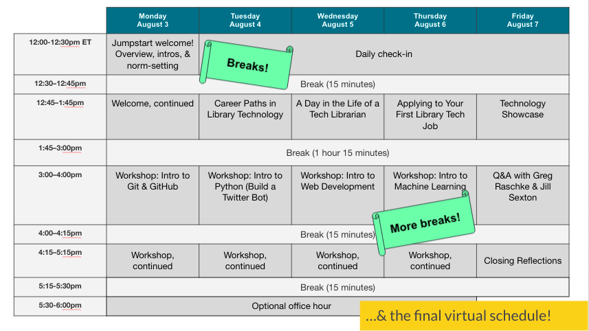

Once we had a planning committee, a clear vision, a tentative budget, and approval from administration to proceed, we turned our attention to building out our schedule. Through some scaffolded brainstorming exercises, we determined the following components to be the foundation for the program we wanted to build: 

- Technical workshops
- Q&A panels with current library tech workers
- A “technology showcase” session to highlight the types of projects library tech workers do
- Sessions with Libraries HR + administration to cover resumê + interview advice
- Mentoring + networking
- Cohort building

## Technical Workshops ##

In developing our menu of technical workshops, we acknowledged up front that we wouldn’t be able to go in depth with any given topic. Our goal, therefore, was to introduce participants to a range of technologies and leave them with next steps for delving deeper after the program wrapped. We tried to select a variety of technologies that were focused on skills that we would like to see in applicants to our entry level positions at the Libraries, but also ones that are broadly applicable across the different areas of library technology. Workshop leaders met as a group several times leading up to the program to ensure that the workshops had some connection and flow between them.

- [Day 1: Intro to Git & GitHub](https://docs.google.com/document/d/1mtxuzZEBdFzFx-JS62eF-XIPb6N7WMsKR07CnQb_Qg8/edit?usp=sharing) -- We began with an introduction to version control using Git & GitHub so that participants could develop an understanding of the type of collaborative workflows they might encounter in library technology positions. Starting with Git & GitHub also allowed participants to get used to saving their work in a repository early on so that they might continue to practice using Git & GitHub as a place to keep their work throughout the rest of the workshops. Our hope was that GitHub could serve as a portfolio for participants that they could continue to add to and build up after the program ended as well. 
- [Day 2: Intro to Python with Twitter Bots](https://github.com/cullerth/bot-tutorial-jumpstart) -- We chose Python as the programming language to use throughout the rest of the workshops. Because participants were mostly early on in their journey of building their tech skills, we thought standardizing this was important and know Python to be a common first language for beginners and one that is widely used in the field. In this workshop, we introduced participants to Python by walking them through the process for how to create a Twitter bot -- a challenging but accessible and engaging exercise with clear outputs that left participants feeling accomplished.
- [Day 3: Intro to Web Development](https://jumpstart-webdev.netlify.app/) -- Much of the work we do in libraries and archives involves discovery and delivery of resources and information to end users. And the foundation of how we do that work is the web. In this workshop, we built on some of the Twitter bot work to create a web application where users could add, display, edit and remove content generated by their bots. Participants were introduced to how information flows on the web, and gained hands-on experience creating web applications that stored/retrieved information from a database and displayed it back to users using technologies like HTML/CSS.
- [Day 4: Intro to Machine Learning](https://github.com/vrtompki/Jumpstart-ML-Workshop/blob/master/Setup/Setup_Guide.md) -- We wanted to look at mostly foundational skills, but also choose one that would be a "stretch" day, giving participants a glimpse of an up and coming area in library technology. In this workshop, participants were introduced to the area of machine learning and how it is being applied in the LIS context as well as tools commonly used in this type of work like Jupyter Notebooks. They gained hands-on experience creating a machine learning model using real library data.

## “Day-in-the-Life” and “Career Path” panels ##
In addition to our technical workshops, we also thought that it was important for participants to hear from current library technology professionals about how they arrived in their current role as well as what it is like to work in the field. We created the “Day-in-the-Life” and “Career Path” panels to touch on these topics and to include perspectives from a wide array of staff at various levels, from early career to mid-level management and administration, to a range of technical departments and roles across the library. Our goal with these panels was to draw connections between the skills we were introducing the participants to and the work that actually happens in libraries. We wanted to make it clear to participants that you don’t necessarily need a computer science background to get into library technology, and that you can begin the process of setting yourself up for success as a library technologist early on in your library school program. By curating a diverse set of panelists, we hoped that participants could make connections with some aspect of their own background or experience, and that the panelists’ messages would resonate with them.

## Technology Showcase ##
In a similar vein, the technology showcase panel was a chance for participants to get a better sense of the types of projects that they might get to work on someday as a library technologist. Participants were introduced to projects that spanned a wide array of topics and departments -- from a IIIF annotation project out of our Digital Library Initiatives department, to a workflow automation project from Collections & Research Strategy, and a web accessibility project from User Experience. Participants reported that this session in particular allowed them to truly envision what a career in library technology might look like and how the skills they were learning with us fit in with that. 

## High Level HR & Admin Sessions ##
The types of sessions led by Libraries HR and administration included an ‘Applying to Your First Library Tech Job’ panel and a Q&A with Libraries Administration session. In the [‘Applying to Your First Library Tech Job’](https://drive.google.com/file/d/1DwLwPVbdh4ZxZ4CrlTZn-USQjiNo7XNT/view?usp=sharing) panel Jennifer Garrett, our Director of Talent Management and Jason Ronallo, the department head of Digital Library Initiatives, topics covered things such as resumé dos and don’ts, what to expect from a technical interview session, what a sample in-person interview schedule and set of questions might look like, etc. The Q&A session with Greg Raschke, Senior Vice Provost and Director of Libraries, and Jill Sexton, Associate Director for Digital and Organization Strategy, was a chance for participants to learn about the organizational structure of a library system from a high level perspective and to gain insight into what Libraries administrators see as the future of library technology.

## Mentoring and Networking ##
The way we approached mentoring and networking involved setting up a formal one-on-one mentorship program and hosting daily office hours. In pairing participants with a mentor, we referred to their application materials and notes from our interviews with each participant to ascertain their interests and career goals so that we might pair them with a mentor with a similar background. We gave each mentor [a guide with which to establish the relationship](https://docs.google.com/document/d/1C4BodMDGf__QVyf6Meo3XnSjivth0-qczrRUnrjEZWU/edit?usp=sharing), and set the expectation that each mentor and mentee would meet at least once during the week of the program and at least once sometime afterwards. The daily office hours were an optional half hour tacked on to the end of each day of the program where the day’s workshop leaders as well as the planning committee were present to answer any additional questions they may have had that weren’t able to be addressed during the day. In addition to the formal mentorship program and the optional office hours, we were also sure to consistently reiterate that  participants should consider any person that they met during the week as a new professional contact that they could feel free to reach back out to when needed. We wanted to establish a friendly atmosphere in which participants felt part of a supportive professional community.

## Cohort Building ## 
We facilitated cohort building by kicking off the program with a group norm setting exercise, starting each day with an icebreaker and a reflection session, and encouraging participants to engage with one another in a Slack community that they created and maintained. Had we been in-person, there would have been the opportunity to host social events and prompt more casual conversations, but the strategies we used in lieu of these options were a decent stand-in. (See: ‘Step 5: Program Lead-up’ for more information)

## Asynchronous Content Bundle ##
Given that the program was originally scheduled as an in-person event but had to be converted to a virtual format, we had to cut several of our synchronous sessions. Rather than cutting them entirely, however, we organized [a bundle of asynchronous content](https://drive.google.com/drive/folders/1kWSW5rN7-6GiXENiiiNcpWE9LUvwt5Wh?usp=sharing) and offered participants this material in a variety of mediums.

Our asynchronous content included…
- [‘Day-in-the-Life’](https://drive.google.com/drive/folders/14f2wUTqKzuk6KsMndurdNIqlpj2kRzyk?usp=sharing) and [‘Career Path’](https://drive.google.com/drive/folders/1HQleHg6Ed-ZZgyU_TT-H6mkwyxC4UMg8?usp=sharing) profiles -- One-pager summaries of each of our panelists' job duties and career advice for students and early-career professionals. 
- [Tech showcase profiles](https://drive.google.com/drive/folders/1PfruiKFZAhNSD6Qww6YEinQ-SquOHV_i?usp=sharing) -- This folder includes links to the presentations that were part of the synchronous panel as well as links to slide-deck and video presentations highlighting additional projects.
- [Building A Portfolio + Your Web Presence](https://drive.google.com/file/d/1TOEftxcxBwEqnyZazGcSxWweiPCEkKoE/view?usp=sharing) -- “Your business card is the Internet! In this session, we will discuss how to control how you appear in a web search and how to showcase yourself and your work. This slide deck covers the pros and cons of  joining academic social networks and walks you through the process of writing a reusable bio for yourself and sketching out a plan for your web presence.”
- [Navigating the Profession](https://docs.google.com/document/d/1HLzV3-arQuNIBxeSAgLbcOhvSTtrW26OV2etU8uwPEw/edit?usp=sharing) -- A Vimeo video showcase in which panelists answer questions about navigating the profession as an early career librarian.

Participants reported that having access to this content to go over in their own time and to have to refer back to later, perhaps when they are looking to begin the job application process,was an added bonus that they appreciated. 

> Tip: In developing your slate of content, revisit your program vision and goals and think carefully about what skills make sense to teach given your particular context. What is it that you want your participants to walk away knowing? What is your capacity as an organization -- do you have folks who have the expertise and bandwidth to lead a workshop on X or Y? If not, can you bring in external partners? These are the types of questions you need to think through early on.  

## Constraints & Considerations ##
There were many challenges we had to work through in developing a cohesive program schedule. Chief among them was the switch from an in-person schedule to an online one as well as recognizing that our time with participants was limited and that we wouldn’t be able to go particularly in depth with any specific skill. In dealing with the switch from online to in-person, we leaned in to the affordances of online delivery by taking it as an opportunity to streamline our schedule in a way that provided room for a more reasonably paced slate of workshops and panels with plenty of built-in breaks and the development of the reusable asynchronous content mentioned above. And while we weren’t able to dive deep into any of the tech skills we touched on, we instead put our energy into leaving participants with a solid foundation and set of resources from which to grow on their own while emphasizing the value of our other sessions on career advice and preparedness. In addition to developing tech skills, we were focused on having participants come away with a renewed sense of clarity and excitement around careers in library technology.

> Tip: Don’t forget to factor in things like time zones, school and work schedules, and accessibility when filling in your schedule. In thinking through the flow of each day, it’s best to balance workshop material with presentations and panels to provide the kind of variety that fosters sustained engagement.   

[Next >> Step 5: Program Lead-up](https://ncsu-libraries.github.io/jumpstart-framework/leadup.html)