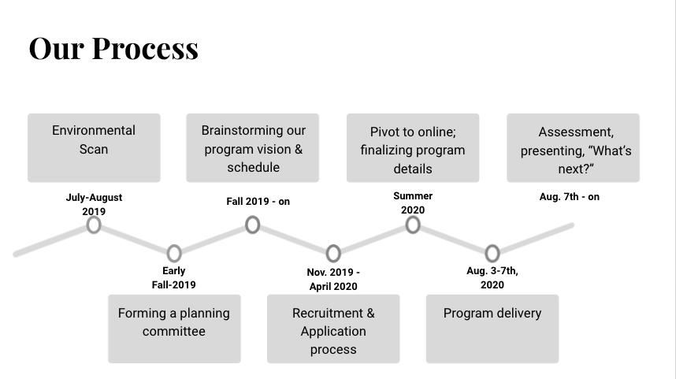

## Our Timeline ##

The process for planning the first iteration of the Jumpstart Program spanned the entirety of a year. Stretching the planning process out over this amount of time meant that we never felt rushed and that we had the flexibility to adapt to unforeseen circumstances (in this case: Covid-19). Planning for the second offering of the program was able to be condensed into a somewhat shorter time frame given the foundations we laid in the first offering, but planning the second offering also involved its own time and resource investments unique to brainstorming and implementing iterative improvements. 

> Tip: Start planning early to accommodate unforeseen roadblocks, especially the first time you host a program like this.

[Next >> Step 1: Environmental Scan](https://ncsu-libraries.github.io/jumpstart-framework/environmental_scan.html)

 

Last updated on `r format(Sys.time(), '%B %d, %Y.')`